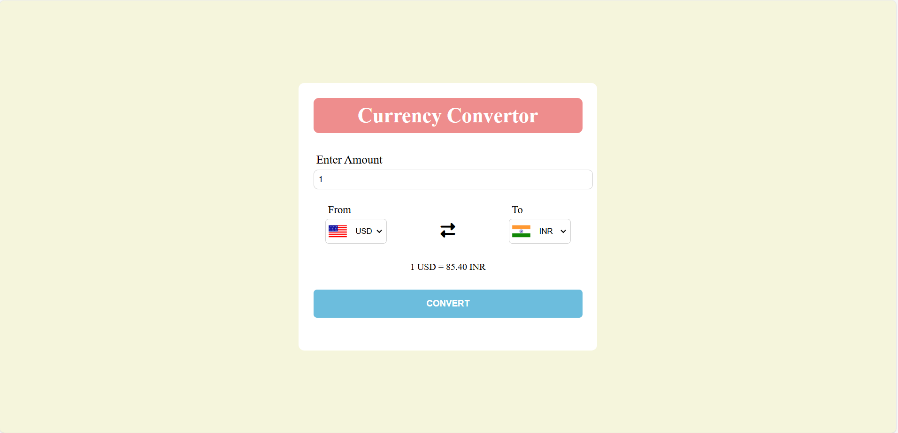

# 💱 Currency Convertor

A sleek and responsive currency converter web application built using **HTML**, **CSS**, and **JavaScript**. This project fetches real-time currency exchange rates via an open-source API and updates values dynamically. It also uses country flags to enhance the user interface for a more intuitive experience.

## ✨ Features

- 🔁 Convert between multiple currencies
- 🌐 Real-time exchange rates using [Fawaz Ahmed's Currency API](https://github.com/fawazahmed0/currency-api)
- 🖼️ Dynamic country flags for better UX
- 📱 Fully responsive and easy to use

## 🚀 Technologies Used

- HTML5  
- CSS3  
- JavaScript (Vanilla JS)  
- Currency API (via CDN)  
- Flags API

## 🖼️ Preview



> Replace the above link with a screenshot of your site (upload in your repo and paste the relative path or GitHub URL)

## 📂 Project Structure

```plaintext
CurrencyConvertor/
│
├── index.html
├── style.css
├── script.js
├── Codes.js
├── screenshot.png
└── README.md
```
